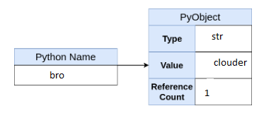
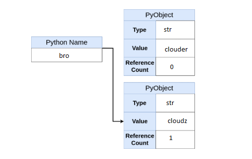
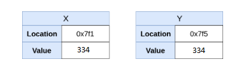

### 浅谈python中的变量

#### 目录

- [前言](#前言)
- [Python中的变量](#Python中的变量)
  - [什么是变量](#什么是变量)

  - [变量的创建过程](#变量的创建过程)
- [总结](#总结)

#### 前言

几乎在学习所有编程语言的时候， 我们首先输出的就是“hello world”，这意味着你打开了一个“新世界”。然后， 接下来就是我们本篇所要讲的变量了。编码的过程中， 无时不刻不再与变量打着交道， 所以理解它还是很有必要的。

**本篇适宜对象：**

初入或者python初级码农。

**重要内容：**

python中变量的本质

**Note：**如果你了解一点c或c++等语言的话， 可能需要更新一下对于python中变量的理解。


#### Python中的变量

#### 什么是变量

百科的解释是：

> 变量来源于数学，是计算机语言中能储存计算结果或能表示值抽象概念。

换句话说就是：变量可以让你把程序中准备使用的每一段数据都给予一个易于理解、记忆的名字。

举个例子好比说，马拉松的时候会给每个人一个号牌， 而这个号牌就是一个变量， 它就代表了一个人，而且它是一个可变的的变量，因为下一次可能同样是3号牌，它代表了是另一个人。

上面说到了“可变”的变量， 这意味着还有不可变得变量， 或许有点绕，变量变量怎么还不可变了。这么来说：每个人都有一个身份证， 通过这个身份证号就可以找到对应的人， 这个关系是绑定的、是不会变的。

**在Python中变量有些不一样。**

在C语言中变量相当于一个占位符， 它引用了计算机的内存地址， 这个地址存储了具体的信息，如下图：

int x = 333

<table align="left">
   <tr>
      <th colspan=2 align="center">X</th>
   </tr>
   <tr>
      <td>location</td>
      <td>0x7f1</td>
   </tr>
   <tr>
      <td>value</td>
      <td>333</td>
   </tr>
</table>


当我们执行x = 334时， 它会变成这样：

<table align="left">
   <tr>
      <th colspan=2 align="center">X</th>
   </tr>
   <tr>
      <td>location</td>
      <td>0x7f1</td>
   </tr>
   <tr>
      <td>value</td>
      <td>334</td>
   </tr>
</table>


由此我们可以知道， 在C中， 变量值变化的时候， 它对应的内存地址不会变， 只是改变了对应的值，而在python中会是如此么？

我们在REPL中试一下：

```python

In [8]: x = 333
In [9]: id(x)
Out[9]: 2013557464752

In [10]: x = 334
In [11]: id(x)
Out[11]: 2013557514576
```

id是个内建函数， 用来获取变量的内存地址。

我们可以看到改变值后， 内存地址也变了！这和C中的处理是不一样的！

为什么呢？想一想。

要弄清这个问题， 我们需要知道在python中， 我们执行x = 333 和x = 334时， python解释器为我们做了什么。


#### 变量的创建过程

有一点我们已经知道， 在python中一切都是对象。如下：

```python
In [14]: isinstance(int, object)
Out[14]: True

In [15]: isinstance(list, object)
Out[15]: True

In [16]: isinstance(tuple, object)
Out[16]: True

In [17]: isinstance(dict, object)
Out[17]: True

In [18]: isinstance(set, object)
Out[18]: True

In [19]: isinstance(..., object)
Out[19]: True

```

一个对象包含了至少三个信息：类型（type）、引用计数（reference count）、值（value）。

拿 bro = 'clouder'举例：

```python
In [21]: bro = 'clouder'

In [22]: type(bro)
Out[22]: str

In [23]: import sys

In [24]: sys.getrefcount(bro)
Out[24]: 2

In [25]: bro
Out[25]: 'clouder'
```

以上， 我们可以看到bro是str类型、 当前引用数为2（bro和作为参数传递给sys.getrefcount）、值为‘clouder’。

回到上面的问题， 我们执行x = 'clouder'的时候， 解释器做了哪些事情呢？具体来说有以下几步：

- 创建一个PyObject
- 将该PyObject的类型设置为str
- 给PyObject赋值‘clouder’
- 创建一个名称bro
- 将bro指向该PyObject
- PyObject的引用计数加1

**Note：**此处的PyObject比不是python的对象， 它特指CPython（python有不同的实现版本），是一个C的结构体， 它是所有python对象的基础。

在内存中， 它看起来应该是这个样子的：



现在如果我们将bro的值改为‘cloudz’，又会如何呢？

```python
In [25]: bro
Out[25]: 'clouder'

In [26]: id(bro)
Out[26]: 2013566666096

In [27]: bro = 'cloudz'

In [28]: id(bro)
Out[28]: 2013566773936
```

内存地址变了， 这个过程中， 发生哪些事情呢？思考一下， 往下看。

有以下几步：

- 创建一个新的PyObject
- 将新的PyObject的类型设置为str
- 给新的PyObject赋值‘clouder’
- 将bro指向新的PyObject
- 新的PyObject的引用计数加1
- 旧的PYObject的引用计数减1

内存中， 如下面这个样子：




还有一点，当进行变量赋值的时候， C和python中又会有什么不一样呢？

不卖关子了， 直说吧：

进行y =x 的时候，在C语言中， 它会新申请一个内存空间，然后放入334。内存中是类似这样的：



而在python中执行类似操作bro2 = bro,实际是这样的：

```python
In [3]: id(bro)
Out[3]: 2184242822816

In [5]: bro2 = bro

In [6]: id(bro2)
Out[6]: 2184242822816
    
In [8]: sys.getrefcount(bro)
Out[8]: 3
```

看到没， 内存地址没有变化，只是该对象的引用计数加了1。

#### 总结

到这里， 我们对python中变量的创建过程应该有一个清晰的认识了。不难看出python成的变量和C中的变量并不一样：在C中， 变量引用的是一个内存地址， 当值改变的时候， 是该地址上的值发生变化， 内存地址是不变的。而python则不一样，改变值得时候， 它是新建了一个对象， 然后将该变量指向了这个新的对象， 内存地址已经发生的变化。


